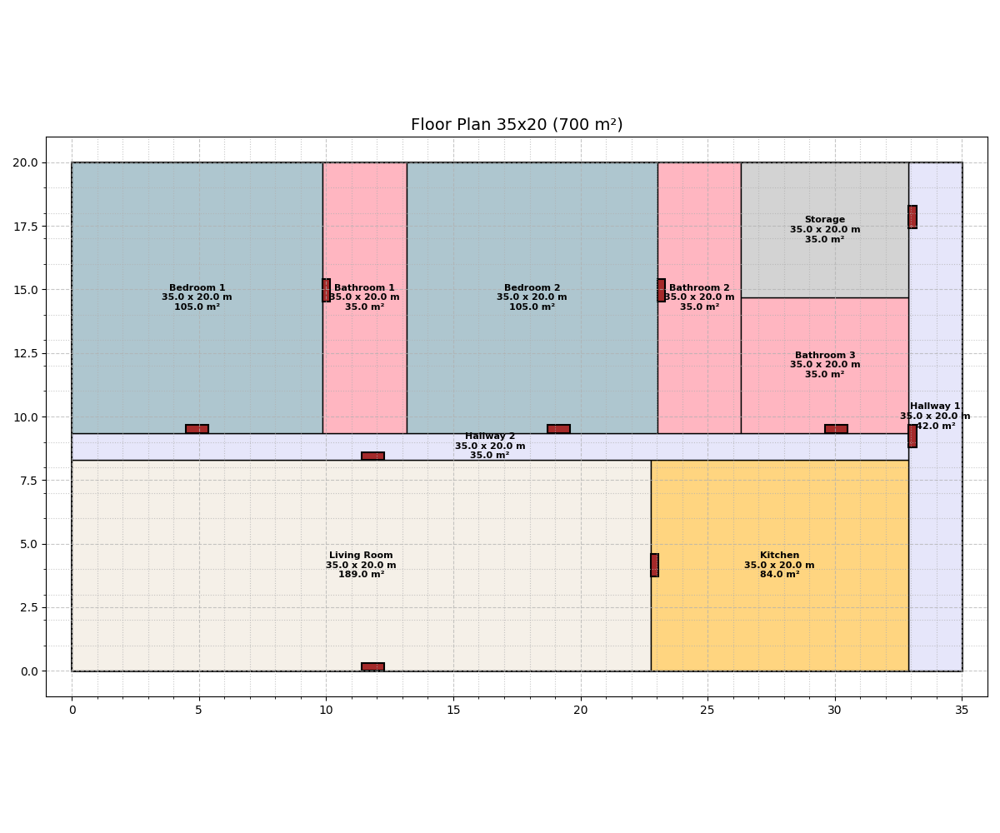

<div align="center">


# WhitePrint AI

**Intelligent Architectural Design Assistant**  
*Powered by LangGraph & AI Agents*

</div>

An AI-powered floor plan generator that demonstrates automated residential layout generation from natural language descriptions. This system showcases the potential of multi-agent AI workflows in architectural design while highlighting current limitations of AI spatial reasoning.

## Demonstrated Capabilities

- **Multi-Agent Workflow** - LangGraph orchestration with specialized AI agents
- **Structured Data Processing** - Pydantic models for validated LLM outputs
- **Architectural Constraint Handling** - Ensuite bathroom logic and spatial relationships
- **Interactive Terminal UI** - Rich progress bars and professional presentation
- **Automated Validation Pipeline** - Multiple quality checkpoints throughout generation
- **Prompt Engineering Excellence** - Sophisticated template system for consistent results

### What Works Well:
✅ Complex workflow orchestration  
✅ Structured LLM output validation  
✅ Real-time progress tracking  
✅ Professional visualization generation  

## Technical Architecture

WhitePrint AI demonstrates a **sophisticated multi-agent workflow** using LangGraph for architectural design automation:

### Workflow Components:
- **Input Validation Agent**: Filters unreasonable requests
- **Room Allocation Agent**: Calculates space proportions and house dimensions
- **Layout Planning Agent**: Positions rooms using 3-row strategy
- **Door Planning Agent**: Creates connectivity between spaces
- **Validation & Rendering**: Quality checks and visualization generation

### Layout Strategy:
- **Bottom Row**: Living Room + Kitchen (main living areas)
- **Middle Row**: Wide hallway system for connectivity
- **Top Row**: Bedroom-bathroom ensuite pairs + guest facilities + storage

**Key Innovation**: Multi-agent validation pipeline with iterative refinement and architectural constraint handling.

## Quick Start

### Prerequisites

- Python 3.8+
- OpenAI API key or Google AI API key
- Required Python packages (see `pyproject.toml`)

### Installation

1. **Clone the repository**
   ```bash
   git clone <repository-url>
   cd whiteprint-ai
   ```

2. **Install dependencies**
   ```bash
   pip install -r requirements.txt
   # or if using uv:
   uv sync
   ```

3. **Set up environment variables**
   ```bash
   cp .env.example .env
   # Edit .env with your API keys
   ```

4. **Run the application**
   ```bash
   python main.py
   ```

5. **Enter your floor plan request**
   The application will prompt you for input with helpful examples:
   ```
   🏠 Describe your ideal floor plan using natural language

   💡 Example requests:
      • House 500m² with 3 bedrooms, 2 bathrooms, living room and kitchen
      • 600m² home with 2 bedrooms with ensuite bathrooms and guest bathroom
      • Large family house 800m² with 4 bedrooms, 3 bathrooms, and storage
      • Apartment 400m² with 2 bedrooms, living room, kitchen, and balcony

   🏗️  Enter your floor plan request: 
   ```

### Environment Variables

Create a `.env` file with:

```env
# LLM Configuration
LLM_PROVIDER=google_genai          # or openai
LLM_MODEL=gemini-2.5-flash         # or gpt-4
LLM_TEMPERATURE=0.1
GOOGLE_API_KEY=your_api_key_here   # if using Google AI
OPENAI_API_KEY=your_api_key_here   # if using OpenAI
```

## Usage Examples

### Interactive Usage (Recommended)

Simply run the application and follow the interactive prompts:

```bash
python main.py
```

The application will guide you through the process with examples and validation.

### Programmatic Usage

For integration into other applications:

```python
from main import graph

# Simple house request
result = graph.invoke({
    "input": "House 500m² with 3 bedrooms, 2 bathrooms, living room and kitchen"
})

# Advanced request with specific requirements
result = graph.invoke({
    "input": "House 800m² with 2 bedrooms with ensuite bathrooms, 1 guest bathroom, living room, kitchen, and storage room by the hallway"
})
```

### Example Inputs

The system accepts natural language descriptions like:
- `"House 600m² with 4 bedrooms and 3 bathrooms"`
- `"300m² apartment with 2 bedrooms, living room, kitchen, and balcony"`
- `"Large family home 1000m² with 5 bedrooms, 4 bathrooms, and storage"`
- `"Cozy 400m² house with 2 bedrooms, each with ensuite bathroom"`

### User Experience Features

- **Interactive Prompts**: Guided input with helpful examples
- **Input Validation**: Ensures meaningful floor plan requests
- **Real-time Progress**: Rich progress bars showing generation steps
- **Error Handling**: Graceful handling of invalid inputs or system errors
- **Professional Output**: Clean terminal interface with organized results

## Workflow Architecture

WhitePrint AI uses **LangGraph** to orchestrate the floor plan generation process:

```
Input → Validation → Room Allocation → Layout Planning → Door Planning → Rendering → Output
```

### Key Components

1. **Input Validation** (`verify_request`)
   - Validates user requests for feasibility
   - Filters out impossible or unreasonable requirements

2. **Room Allocation** (`room_allocator`)
   - Determines house dimensions and total area
   - Allocates space proportions for each room type
   - Ensures essential rooms are included (kitchen, bathrooms, etc.)

3. **Layout Planning** (`room_planner`)
   - Positions rooms using the 3-row strategy
   - Maintains ensuite bedroom-bathroom adjacency
   - Optimizes space utilization to eliminate gaps

4. **Door Planning** (`door_planner`)
   - Creates door connections between rooms
   - Preserves ensuite privacy (bathrooms connect only to their bedrooms)
   - Ensures accessibility via hallway networks

5. **Validation & Rendering**
   - Removes duplicate connections
   - Generates beautiful matplotlib visualizations
   - Saves final floor plan as PNG

## Project Structure

```
whiteprint-ai/
├── main.py              # Main application and workflow definition
├── models.py            # Pydantic data models and TypedDict definitions
├── prompts.py           # AI prompt templates using LangChain PromptTemplate
├── utils.py             # Visualization and utility functions
├── niceterminalui.py    # Rich-based terminal UI components
├── .env                 # Environment configuration
├── pyproject.toml       # Project dependencies
└── README.md           # Project documentation
```

## Key Features Explained

### Ensuite Bathroom Strategy
- **Bedroom 1 ↔ Bathroom 1**: Direct private connection
- **Bedroom 2 ↔ Bathroom 2**: Direct private connection  
- **Guest Bathroom**: Accessible via hallway system only

### Flexible Hallway Networks
- Multiple hallways (Hallway 1, Hallway 2, etc.) for optimal connectivity
- Wider hallways for comfortable circulation (minimum 2-3 meters)
- L-shaped, T-shaped, or linear configurations based on layout needs

### Space Optimization
- Rooms expand to fill allocated areas and eliminate gaps
- Smart proportion allocation prevents micro-rooms (minimum 5m²)
- Efficient use of every square meter within house boundaries

## Technical Stack

- **LangGraph**: Workflow orchestration and state management
- **LangChain**: LLM integration and prompt templating
- **Pydantic**: Data validation and structured outputs
- **Matplotlib**: Floor plan visualization
- **Rich**: Beautiful terminal UI with progress bars
- **Python 3.8+**: Core runtime

## Development

### Code Structure

The application follows a modular design:
- **State Management**: `FloorPlanState` TypedDict for workflow state
- **Data Models**: Pydantic models for structured LLM outputs
- **Prompt Engineering**: Organized templates in `prompts.py`
- **UI Components**: Rich-based terminal interface

### Adding New Features

1. **New Room Types**: Add to `ROOM_COLORS` in `utils.py`
2. **Layout Strategies**: Modify prompts in `prompts.py`
3. **Validation Rules**: Update validation functions in `main.py`
4. **UI Enhancements**: Extend `niceterminalui.py`

## Example Output

WhitePrint AI generates professional floor plans with:
- Room dimensions and areas
- Door connections
- Color-coded room types
- Grid overlay for precise measurements
- Title with house specifications

### Sample Floor Plan

<div align="center">



*Sample 700m² layout with 2 bedrooms, ensuite bathrooms, guest bathroom, and storage*

</div>

**Generated Layout Breakdown:**
- Living Room: 182m² (26%)
- Kitchen: 84m² (12%)
- Bedroom 1: 105m² (15%) + Bathroom 1: 42m² (6%)
- Bedroom 2: 105m² (15%) + Bathroom 2: 42m² (6%)
- Guest Bathroom: 35m² (5%)
- Main Hallway: 84m² (12%)
- Storage: 21m² (3%)

## Project Status: Proof of Concept

**Current Limitations**: This is a proof-of-concept system demonstrating AI workflow orchestration in architectural design. The generated floor plans showcase both the potential and current limitations of AI spatial reasoning:

**Known Issues**:
- **Spatial Logic Errors**: AI may create impractical room connections (e.g., accessing storage through bathrooms)
- **Layout Quality Variance**: Results depend heavily on prompt engineering and LLM model capabilities
- **Architectural Soundness**: Generated layouts may violate practical building codes or livability standards
- **Room Proportions**: AI sometimes creates mathematically correct but functionally poor room shapes

**Technical Achievement**: 
- ✅ Successfully demonstrates multi-agent AI workflow using LangGraph
- ✅ Implements structured data validation with Pydantic
- ✅ Shows intelligent prompt engineering and iterative validation
- ✅ Creates functional visualization pipeline
- ✅ Handles complex architectural constraints (ensuite bathrooms, hallway networks)

**Future Improvements**:
- Advanced spatial reasoning models
- Integration with CAD systems
- Building code validation
- 3D visualization capabilities
- Professional architectural review integration

**Note**: This system demonstrates the current state of AI in architectural design - powerful workflow orchestration with spatial reasoning limitations. It serves as a foundation for future development rather than a production-ready tool.

## Contributing

1. Fork the repository
2. Create a feature branch (`git checkout -b feature/amazing-feature`)
3. Commit your changes (`git commit -m 'Add amazing feature'`)
4. Push to the branch (`git push origin feature/amazing-feature`)
5. Open a Pull Request

## License

This project is licensed under the MIT License - see the LICENSE file for details.

## Acknowledgments

- **LangGraph** for workflow orchestration
- **LangChain** for LLM integration
- **Rich** for beautiful terminal interfaces
- **Pydantic** for data validation

---

**WhitePrint AI** - Making beautiful architecture accessible through AI